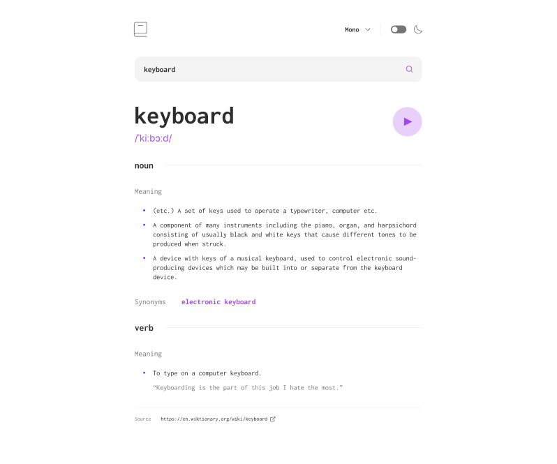

# 📚 Dictionary App

A responsive dictionary app built with **Next.js 14** and **Tailwind CSS**, supporting light and dark themes. Users can search for word definitions, view parts of speech, hear pronunciations, and explore synonyms — all presented with a modern UI.

# Features
- Instant word lookup with auto-formatted results
-  Audio pronunciation with a play button
-  Dark mode toggle for enhanced accessibility
-  Displays meanings, word types, synonyms, and example usage
-  Fast page transitions with Next.js App Router and layout features

# Tech Stack
- Next.js (App Router)
- TypeScript
- Tailwind CSS
- Dictionary API (e.g., Free Dictionary API or similar)
- Responsive layout and modern UX design

